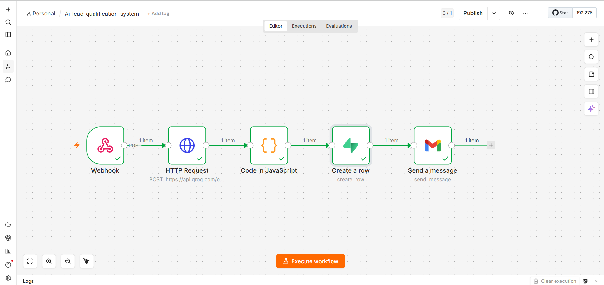

# 🚀 AI Lead Qualification & CRM Automation System

An end-to-end AI-powered automation system that captures leads, analyzes intent using AI, stores structured data in a database, and sends automated email responses.

Built with **n8n · Groq LLaMA 3 · Supabase · Gmail** to simulate a real-world SaaS backend pipeline.

---

## 🧠 What It Does

- Captures lead data via webhook trigger  
- Uses Groq (LLaMA 3) to score and classify each lead  
- Classifies leads as **Cold / Warm / Hot** based on intent  
- Stores structured lead data in Supabase (PostgreSQL)  
- Sends automated email responses via Gmail  

---

## ⚙️ Tech Stack

| Tool | Role |
|------|------|
| **n8n** | Workflow automation engine |
| **Groq API (LLaMA 3)** | AI lead scoring & classification |
| **Supabase** | PostgreSQL database — CRM storage |
| **Gmail API** | Automated email notifications |
| **Webhook** | Data ingestion endpoint |

---

## 🔄 Workflow Architecture

1. **Webhook** — receives incoming lead data  
2. **Groq AI** — evaluates and scores lead intent  
3. **Code Node** — parses and formats AI response  
4. **Supabase** — stores structured CRM data  
5. **Gmail** — sends automated email response  

---

## 📥 Sample Webhook Payload

Send a POST request to the webhook URL:

- **name** — lead's full name  
- **email** — email address  
- **company** — company name  
- **budget** — estimated budget range  
- **employees** — company size  
- **industry** — industry vertical  
- **message** — inquiry or requirement  

---

## 📊 AI Classification Logic

Groq analyzes each lead and returns structured output:

| Score Range | Tier | Action |
|-------------|------|--------|
| 70–100 | 🔥 Hot | Immediate follow-up email |
| 40–69 | 🌤 Warm | Standard response email |
| 0–39 | ❄️ Cold | Generic informational email |

---

## 🗄️ Database Fields (Supabase)

Each lead is stored with:

- name, email, company, budget, employees, industry, message  
- **ai_score** — numeric score (0–100)  
- **tier** — cold / warm / hot  
- **summary** — AI-generated reasoning  
- **created_at** — timestamp  

---

## 🚀 How to Run

1. Import `workflow.json` into n8n  
2. Configure credentials:
   - Groq API key (HTTP Request node)
   - Supabase project URL + service role key
   - Gmail OAuth2 in n8n credentials  
3. Activate the workflow  
4. Send a test POST request to webhook  
5. Verify results in Supabase and email delivery  

---

## 📁 Project Structure

- **workflow.json** — n8n automation workflow  
- **assets/** — screenshots and visuals  
- **README.md** — project documentation  
- **sample-payload.json** — test webhook data  

---

## 🔮 Future Improvements

- API key-based multi-user SaaS system  
- Lead routing rules engine  
- Slack / WhatsApp hot lead alerts  
- Analytics dashboard (Next.js)  
- Subscription-based pricing model  

---

## 📄 License

MIT License
